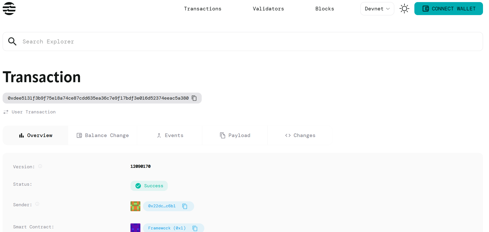

# Certificate Authority

## Project Description

A decentralized certificate issuance system built on the Aptos blockchain that enables educational institutions, training organizations, and certification bodies to issue tamper-proof digital certificates. This smart contract provides a transparent and verifiable way to manage certificate issuance while ensuring authenticity and preventing fraud.

## Project Vision

To revolutionize credential verification by creating a decentralized, transparent, and immutable certificate authority system that eliminates the need for centralized verification processes. Our vision is to build a global network where certificates can be instantly verified by anyone, anywhere, without relying on traditional intermediaries.

## Key Features

### 🔐 **Decentralized Certificate Issuance**
- Remove dependency on centralized authorities
- Enable direct certificate issuance by accredited institutions
- Ensure global accessibility and transparency

### 🛡️ **Immutable Certificate Records**
- Store certificates permanently on the Aptos blockchain
- Prevent tampering, forgery, or unauthorized modifications
- Maintain complete audit trail of all certificate transactions

### ⚡ **Instant Verification**
- Real-time certificate validation using blockchain technology
- Eliminate lengthy verification processes
- Reduce verification costs and time delays

### 🎯 **Authority Management**
- Initialize and manage certificate authorities
- Track certificate issuance statistics
- Maintain registry of all issued certificates

### 📊 **Transparent Tracking**
- Monitor total certificates issued by each authority
- Track certificate validity status
- Maintain chronological record of issuance dates

### 🔍 **Fraud Prevention**
- Unique certificate IDs prevent duplication
- Cryptographic proof of authenticity
- Immutable issuer identification

## Future Scope

### 📱 **Mobile Application Integration**
- Develop mobile apps for easy certificate access and sharing
- QR code generation for quick verification
- Digital wallet integration for certificate storage

### 🤖 **AI-Powered Verification**
- Implement machine learning algorithms for fraud detection
- Automated compliance checking
- Smart matching of credentials with job requirements

### 🌐 **Cross-Platform Interoperability**
- Integration with other blockchain networks
- Support for multiple certificate standards
- API development for third-party integrations

### 📈 **Advanced Analytics**
- Comprehensive dashboard for certificate authorities
- Market insights and trend analysis
- Performance metrics and reporting tools

### 🔄 **Certificate Lifecycle Management**
- Renewal and expiration handling
- Automatic status updates
- Revocation mechanisms for invalid certificates

### 🏢 **Enterprise Solutions**
- Multi-tenant architecture for large organizations
- Role-based access control
- Bulk certificate issuance capabilities

### 🌍 **Global Standardization**
- Work with international bodies for standard adoption
- Multi-language support
- Compliance with global education frameworks

## Contract Details

0xdee5131f3b9f75e18a74ce87cdd635ea36c7e9f17bdf3e016d52374eeac5a380

---

**Built on Aptos Blockchain** | **Move Smart Contract** | **Decentralized & Secure**